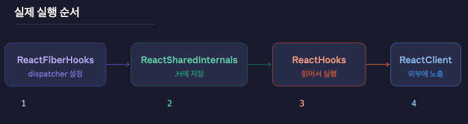
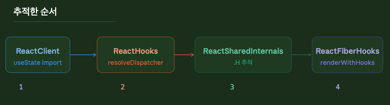

import CodeWithLineNotes from '../../../components/CodeWithLineNotes.astro';


> [Rules of Hooks](https://legacy.reactjs.org/docs/hooks-rules.html)를 보고 느낀 궁금증에 대해 서술한 글입니다. | 2026-03-10 기준

이전글에서는 Function 컴포넌트에서 Hook을 사용하기 위한 규칙을 알아보았고, 'Hook이 순서에 따라 작동하는 것'을 알 수 있었습니다. 그렇다면 Hook이 순서에 따라 작동하게 해주는 React 코드구조는 어떨까요?   

이번글에서는 Hook을 작동시키는 React Core Code를 분석 해보고, 그 구조와 작동원리를 알아보겠습니다.  

#### 1. 컴포넌트안의 Hooks 작동순서

먼저, 이전글에서 얘기했던 Hooks 작동순서를 리뷰해 보겠습니다.  
실제로 공식문서를 살펴보면, <u style="color: red; font-weight: bold;">React가 Hooks의 호출되는 순서에 의존</u>한다고 말하고 있습니다.

<CodeWithLineNotes
  code={
  `
    function Form() {
      const [name, setName] = useState('Mary');
      useEffect(function persistForm() {
        localStorage.setItem('formData', name);
      });

      const [surname, setSurname] = useState('Poppins');
      useEffect(function updateTitle() {
        document.title = name + ' ' + surname;
      });
    }
   ` 
  }

  notes={{
    3: "1. name 상태 변수를 사용한다",
    5: "2. 폼을 저장하는 데 쓰이는 UseEffect를 사용한다",
    8: "3. surname 상태 변수를 사용한다",
    10: "4. 타이틀을 갱신하는 데 쓰이는 UseEffect를 사용한다"
  }}

/>

이어서 Hooks가 아래처럼 1 -> 2 -> 3 -> 4 순으로 작동한다고 설명합니다. (작동내용은 조금 다릅니다.) 

```jsx
    // ------------
    // 초기-랜더링
    // ------------
    useState('Mary')           // 1. 'Mary'로 name 상태 변수를 초기화한다.
    useEffect(persistForm)     // 2. 폼을 저장하기 위한 effect를 추가한다.
    useState('Poppins')        // 3. 'Poppins'로 surname 상태 변수를 초기화한다.
    useEffect(updateTitle)     // 4. 타이틀을 갱신하기 위한 effect를 추가한다.

    // -------------
    // 리-랜더링
    // -------------
    useState('Mary')           // 1. name 상태 변수를 읽는다(인자는 무시된다).
    useEffect(persistForm)     // 2. 폼을 저장하기 위한 effect를 교체한다.
    useState('Poppins')        // 3. surname 상태 변수를 읽는다(인자는 무시된다).
    useEffect(updateTitle)     // 4. 타이틀을 갱신하기 위한 effect를 교체한다.

    // ...
```
그렇다면 Hook 하나를 조건문으로 감싸면 어떨까요?

#### 2. Hook을 조건문으로 감쌌을경우

만약 순서대로 작동한다면, 조건문이 false일 경우 중간에 누락이 되고... 이후 작동에 영향을 미칠 것입니다.   
잠깐 천천히 생각해 봅시다. 그렇다면 2번의 작동이 false면, 영향을 받는 것은 무엇일까요..?   
<u style="color: red; font-weight: bold;">당연히 3번</u>이라고 생각할 것입니다.  

근데 만약 순서대로 작동하지 않는다면..? <u style="font-weight: bold;">4번</u>이 될수도 있습니다.   
말로는 헷갈릴 수 있으니 빠르게 코드로 넘어가겠습니다.

```jsx
// ------------
// 2번 Hook을 조건문으로 감쌌을경우
// ------------
  if (name !== '') {
    useEffect(function persistForm() {
      localStorage.setItem('formData', name);
    });
  }
```

2번 Hook의 조건문이, false 인 경우

```jsx
useState('Mary')           // 1. name 상태 변수를 읽는다(인자는 무시된다).
// useEffect(persistForm)  // 🔴 이 Hook은 스킵됨!(if문 조건이 false)
useState('Poppins')        // 🔴 2. 2번째(원래는 3번째였다) surname 상태 변수를 읽는 데 실패했다.
useEffect(updateTitle)     // 🔴 3. 3번째(원래는 4번째였다) 해당 effect를 교체하는 데 실패했다.
```

결론적으로는 <u style="color: red; font-weight: bold;">2번 Hook인</u> useEffect(persistForm)작동을 스킵하면서, <u style="color: red; font-weight: bold;">3번째 Hook부터</u> 영향을 받았음을 알 수 있게 되었습니다.
만약 Hook이 순서대로 작동하지 않고, 매핑되어 있었다면... 이런현상은 발생하지 않았을 것입니다.  

또한 이러한 오작동이 일어날 수 있기 때문에,  
공식에서는 <u style="font-weight: bold;">반복문, 조건문, 중첩함수 내부에서 Hooks를 호출하지 마세요</u> 라고 말합니다.

<p style="color: #FF8A65; font-weight: bold;"> - 여기까지가 지난글에서 말한 내용입니다. - </p>

그렇다면 이번주제 : React 구조가 어떻기에, Hooks가 순서대로 작동하는 것일까요?

#### 3. React Core : Hook작동을 추적

먼저 Hook이 어디서부터 왔는지, [ReactClient.js](https://github.com/facebook/react/blob/main/packages/react/src/ReactClient.js)를 확인해 보겠습니다.

```jsx
// ReactClient.js의 import중 일부.
import {
    //...
    useEffect,
    //...
    useState,
    //...
} from './ReactHooks';
```

확인해 보았더니, useEffect와 useState는 [ReactHooks.js](https://github.com/facebook/react/blob/main/packages/react/src/ReactHooks.js)에서 호출되었습니다.

```jsx
// React 내부 전역 상태(훅 구현체 포함)를 모아둔 객체를 가져온다.
import ReactSharedInternals from 'shared/ReactSharedInternals';

function resolveDispatcher() {
  // ReactSharedInternals.H에서 "훅 구현체 모음"을 꺼낸다.
  const dispatcher = ReactSharedInternals.H;
  return ((dispatcher: any): Dispatcher);
}

export function useState<S>(initialState: (() => S) | S) {
  const dispatcher = resolveDispatcher();      // resolveDispatcher() -> dispatcher에 담아줌.
  return dispatcher.useState(initialState);    // 그 안의 useState 실제 구현을 호출한다.
}

export function useEffect(create, deps) {
  const dispatcher = resolveDispatcher();      // resolveDispatcher() -> dispatcher에 담아줌.
  return dispatcher.useEffect(create, deps);   // 그 안의 useEffect 실제 구현을 호출한다.
}
```

[ReactSharedInternals.js](https://github.com/facebook/react/blob/main/packages/shared/ReactSharedInternals.js)에 훅의 재료들이 세팅되어 있는거 같은데요...
한층 더 살펴볼까요?

```jsx
import * as React from 'react';

const ReactSharedInternals =
  React.__CLIENT_INTERNALS_DO_NOT_USE_OR_WARN_USERS_THEY_CANNOT_UPGRADE;

export default ReactSharedInternals;
```

ReactSharedInternals는 React.__CLIENT_INTERNALS_DO_NOT_USE_OR_WARN_USERS_THEY_CANNOT_UPGRADE 라는 객체를 받습니다.  

확인해보니, ReactSharedInternals는 React 내부 전역 상태 객체를 그대로 노출만 하고 있고, 이 객체 안의 H 필드가 나중에 어떤 값으로 채워지는지는 보이지 않습니다.
객체명이 건드리지 말라는 경고문으로 작성되어 있어 재밌군요.

#### 4. ReactSharedInternals.H 안에는 무엇이 들어갈까?

음... 이 시점에서는 ReactSharedInternals에 내부 전역 상태 객체만 들어가지, 확인하고자 했던 ReactSharedInternals.H    
즉, <u style="color: red; font-weight: bold;">실제로 Hook 실행에 관련된 필드 H에 어떤 값이 들어오는지</u>는 알 수 없습니다.

그렇다면 레포에서 `ReactSharedInternals.H`가 <u style="font-weight: bold;">어디서 값이 세팅되는지</u> 확인해 볼 수 있지 않을까요?  
GitHub에서 [ReactSharedInternals.H 키워드로 레포 전체](https://github.com/search?q=repo%3Afacebook%2Freact%20ReactSharedInternals.H&type=code)를 검색해 보았습니다.

#### 5. H -> ReactFiberHooks : 실제 Hook이 작동하는 모듈

검색 결과, `packages/react-reconciler/src/ReactFiberHooks.js` 안의 `renderWithHooks` 함수에서   
원하는 내용을 찾을 수 있었습니다.
```jsx
// ReactFiberHooks.js -> renderWithHooks 내부
import ReactSharedInternals from 'shared/ReactSharedInternals';

export function renderWithHooks<Props, SecondArg>(
  current: Fiber | null,
  workInProgress: Fiber,
  Component: (props: Props, secondArg: SecondArg) => any,
  props: Props,
  secondArg: SecondArg,
) {
  ReactSharedInternals.H =
    current === null || current.memoizedState === null
      // 1. mount(초기-랜더) 시에는 HooksDispatcherOnMount를 ReactSharedInternals.H에 설정한다.  
      ? HooksDispatcherOnMount
      // 2. update(리-랜더) 시에는 HooksDispatcherOnUpdate를 ReactSharedInternals.H에 설정한다.
      : HooksDispatcherOnUpdate;

  // 3. 설정된 Dispatcher 기준으로 Component를 호출해, 내부 useState/useEffect가 각 phase에 맞는 구현을 타게 한다.
  const children = Component(props, secondArg);

  return children;
}

```

확인해보니 `mount` & `update`로 나뉘어, 필드 H에 값이 들어가는 것을 확인할 수 있습니다.  
좋습니다, 슬슬 윤곽이 보이기 시작하는거 같네요. 그렇다면 한번 정리해볼까요?

#### 6. ReactFiberHooks.js, ReactHooks.js는 같은객체를 바라본다.

```jsx
// ReactHooks.js
import ReactSharedInternals from 'shared/ReactSharedInternals';
// -> ReactSharedInternals.H를 "읽는다"

// ReactFiberHooks.js
import ReactSharedInternals from 'shared/ReactSharedInternals';
// -> ReactSharedInternals.H에 값을 "쓴다"
```
>정리 하기에 앞서, 한 가지 짚고 넘어갈 점이 있습니다.
두 파일이 같은 경로 'shared/ReactSharedInternals'에서 import하고 있는데, 그렇다면 두 파일이 바라보는 <u style="font-weight: bold;">React.__CLIENT_INTERNALS_DO_NOT...</u>객체는 정말 같은 객체일까요?
결론부터 말하자면, 같은 객체입니다. 

>ES Module은 같은 경로의 모듈을 최초 1번만 실행하고, 그 결과를 캐시합니다. 이후에 다른 파일이 같은 경로를 import하면, 모듈을 다시 실행하지 않고 캐시된 동일한 결과를 반환합니다.

즉, ReactFiberHooks.js에서 .H에 값을 써넣으면, 같은 객체를 바라보는 ReactHooks.js에서 그 값을 바로 읽을 수 있는 것입니다.

```jsx
import * as React from 'react';
// ReactSharedInternals.js
const ReactSharedInternals =
  // ReactFiberHooks, ReactHooks이 바라보는 전역객체  
  React.__CLIENT_INTERNALS_DO_NOT_USE_OR_WARN_USERS_THEY_CANNOT_UPGRADE;

export default ReactSharedInternals;
```

이로써 [4번](#4-reactsharedinternalsh-안에는-무엇이-들어갈까)에서 알 수 없었던 부분이 해결됩니다. ReactSharedInternals에 어떤 값이 전부 들어가는지는 몰라도, <u style="color: red; font-weight: bold;">지금 시점에서 필요한 .H에 무엇이 들어가는지</u>는 확인할 수 있게 되었습니다.
그럼 정리해볼까요?




```jsx
// 1. ReactFiberHooks.js(ReactSharedInternals.H에 값을 쓴다.)
// 2. ReactSharedInternals.js(React.__CLIENT_INTERNALS_D...에 ReactSharedInternals.H 값을 받고 넘김.)
// 3. ReactHooks.js(ReactSharedInternals.H에 값을 읽는다.)
// 4. ReactClient에서 호출한 Hook을 돌려받는다.
```
이해가 어려우시면... <u style="font-weight: bold;">5->3까지의 코드를 역순</u>으로 보시는걸 추천합니다.

결국, Hook이 초기랜더링 or 리랜더링 상태에 따라 <u style="color: red; font-weight: bold;">전해주는 내용</u>이 다르며, 그 전달받은 내용을 조립하여 useEffect, useState로 돌려준다는 것이 핵심입니다. 

그렇다면 마지막으로.. 한층만 더 <u style="color: blue; font-weight: bold;">DeepDive</u>해볼까요? 
<u style="color: red; font-weight: bold;">그 전해주는 내용</u>은 무엇일까요?

#### 7. ReactFiberHooks가 전해주는 내용

앞서 [5번](#5-h-reactfiberhooks--실제-hook이-작동하는-모듈)
에서 확인한 `ReactFiberHooks - dispatcher 분기`는 "mount를 쓸지, update를 쓸지" 결정하는 곳 이였습니다.
```jsx
// ReactFiberHooks.js -> renderWithHooks 내부
import ReactSharedInternals from 'shared/ReactSharedInternals';

export function renderWithHooks {
  ReactSharedInternals.H =
    current === null || current.memoizedState === null
      // 1. mount(초기-랜더) 시에는 HooksDispatcherOnMount를 ReactSharedInternals.H에 설정한다.  
      ? HooksDispatcherOnMount
      // 2. update(리-랜더) 시에는 HooksDispatcherOnUpdate를 ReactSharedInternals.H에 설정한다.
      : HooksDispatcherOnUpdate;
}

```

여기서 특정되는 것은 `HooksDispatcherOnMount` & `HooksDispatcherOnUpdate`입니다.
그렇다면 이 두 dispatcher는 구체적으로 무엇을 담고 있을까요?

```jsx
const HooksDispatcherOnMount = {
  useState: mountState,
  useEffect: mountEffect,
  useRef: mountRef,
  // ... 모든 Hook의 mount 버전
};

const HooksDispatcherOnUpdate = {
  useState: updateState,
  useEffect: updateEffect,
  useRef: updateRef,
  // ... 모든 Hook의 update 버전
};
```
각 dispatcher는 Hook 구현체 세트 전체를 담고 있는 객체입니다. mount면 mount 세트가, update면 update 세트가 통째로 .H에 들어갑니다.
그리고 이 세트 안의 mountState, updateState 같은 구현 함수들은 내부적으로 mountWorkInProgressHook() / updateWorkInProgressHook()을 호출하는데...
mountState쪽만 확인해 볼까요?
```jsx
function mountState(initialState) {
  const hook = mountWorkInProgressHook();  // 링크드 리스트에 Hook 노드 추가
  if (typeof initialState === 'function') {
    initialState = initialState();
  }
  hook.memoizedState = hook.baseState = initialState;
  const queue = (hook.queue = {
    pending: null,
    dispatch: null,
    lastRenderedReducer: basicStateReducer,
    lastRenderedState: initialState,
  });
  const dispatch = (queue.dispatch = dispatchSetState.bind(
    null,
    currentlyRenderingFiber,
    queue,
  ));
  return [hook.memoizedState, dispatch];  // [상태값, setState함수] 반환
}
```
```jsx
// mountWorkInProgressHook - 처음 렌더 시, Hook 노드를 리스트에 추가
function mountWorkInProgressHook(): Hook {
  const hook: Hook = {
    memoizedState: null,
    baseState: null,
    baseQueue: null,
    queue: null,
    next: null,       // 다음 Hook을 가리키는 포인터
  };

  if (workInProgressHook === null) {
    // 첫 번째 Hook: "리스트 시작점이 없네? 그럼 내가 시작점이야"
    // -> fiber.memoizedState = hook1
    currentlyRenderingFiber.memoizedState = workInProgressHook = hook;
  } else {
    // 두 번째 Hook부터: "리스트 끝에 .next로 이어붙일게"
    // -> hook1.next = hook2
    // -> hook2.next = hook3
    // -> hook3.next = hook4
    workInProgressHook = workInProgressHook.next = hook;
  }
  return workInProgressHook;
}
```
드디어 Hook이 순서대로 쌓이는 실제 로직까지 도달했습니다!  
어쨌든 확인을 해보니...  

컴포넌트가 처음 렌더링될 때, Hook이 호출되는 순서대로 이 링크드 리스트에 노드가 하나씩 추가됩니다.  
[1번 섹션](#1-컴포넌트안의-hooks-작동순서)의 Form 컴포넌트 예시로 보면, 이런 구조가 만들어집니다.

```jsx
useState('Mary') -> useEffect(persistForm) -> useState('Poppins') -> useEffect(updateTitle)
   hook1         ->       hook2            ->       hook3         ->       hook4
   .next     ──────────→  .next      ────────────→  .next   ─────────────→  null
```

조건문 if (workInProgressHook === null)의 null상태를 제외하면, <u style="color: red; font-weight: bold;">각 hook에 .next가 붙으면서 hook1.next, hook2.next ... 이런식으로 링크드 리스트가 순서대로 처리</u> 됨을 알 수 있습니다.

결론적으로, 컴포넌트 안에서 Hook을 호출하는 순서 자체가 <u style="color: red; font-weight: bold;">"몇 번째 Hook 노드를 읽을지(.next)"를 결정하는 인덱스 역할</u>을 하게 되는 것이죠.
중간에 조건문으로 Hook 호출을 건너뛰면, 포인터(.next)가 가리키는 노드가 밀리면서 이후 Hook들이 모두 엉뚱한 상태를 읽게 됩니다.  

앞서 [1번 섹션](#1-컴포넌트안의-hooks-작동순서)에서 Form 예시로 직접 확인했던 그 현상이, 소스코드에서는 바로 이 구조 때문이라는 것을 교차 검증할 수 있습니다.

#### 8. 결론
이번 글에서는 Hook이 작동하는 전체 구조를 추적해 봤습니다. ReactClient -> ReactHooks -> ReactSharedInternals -> ReactFiberHooks까지의 코드를 따라가며, Hook이 순서대로 동작하는 이유가 <u style="color: red; font-weight: bold;">링크드 리스트 구조</u>에 있다는 것을 코어코드에서 확인할 수 있었습니다.
다음 글에서는 같은 방식으로 Redux의 내부 구조를 정적 분석해보겠습니다.
