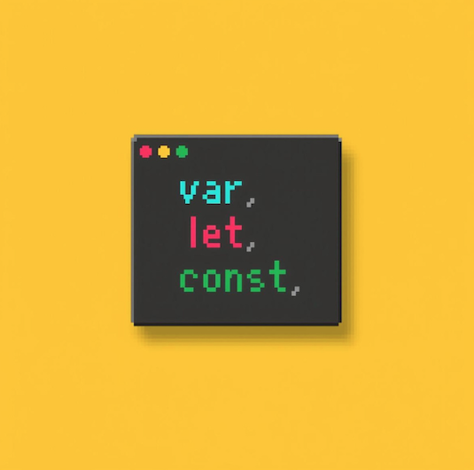

import CodeWithLineNotes from '../../../components/CodeWithLineNotes.astro';

> [공식문서](https://developer.mozilla.org/ko/docs/Web/JavaScript/Reference/Statements/var)를 보고 느낀 의문점에 대해 서술한 글입니다. | 2026-02-20 기준

저의 경우에는 JS를 처음 배울때 var,let,const 중 무엇을 써야할지 많이 헷갈렸습니다. 이를 알기위해 공식문서를 봤었지만, 오히려 의문점만 더 커졌던 경험이 있습니다. 

더불어 "var 쓰지마세요."라는 말도 가끔 들었었는데요, 그렇다면 var는 쓰지않는데 왜 존재하는 것일까요?  
이번 글에서는 그 의문점을 해결하고자 'var의 작동원리와 탄생배경' 그리고 'let, const가 어떻게 생겨났는지' 작성해 보고자 합니다.  

[1. 공식문서의 var설명](#1-공식문서의-var설명)  
[2. var는 왜 이렇게 설계되었을까](#2var는-왜-이렇게-설계되었을까)  

#### 1. "공식문서의 var설명"
그렇다면 var를 배우면서 의문점이 커졌던 점은 무엇이였을까요? 바로 'var와 호이스팅'이였습니다.   
왜냐하면, 기존에 알고있던 블록, 스코프 개념에 혼동을 주었기 때문입니다.

<CodeWithLineNotes
  code={
  `
  // 공식문서의 var설명

  var x = 1;
  if (x === 1) {
    var x = 2;
    console.log(x); // Expected output: 2
  }

  console.log(x);   // Expected output: 2
  `
  }

  notes={{
    4: "1. 전역변수 값이 1인 상태",
    6: "2. 함수 블록 안에서 var x=2로 재선언",
    10: "3. 전역변수 값이 2인 상태(??)"
  }}

/>

보틍은 함수값은 지역변수로서 전역변수에 영향을 주지않는다고 알고 있습니다.  
그러나 2번의 재선언의 경우는 함수스코프를 벗어나서 전역변수에 영향을 주고 있는 것으로 보입니다.

또한 공식문서에서 '변수를 선언, 선택적으로 초기화 할 수 있습니다.' 라고 설명하고 있습니다.  
"변수를 선언한다."까지는 이해가 된다해도... "선택적으로 초기화 할 수 있다?"

일단은 코드와 공식문서 설명이 매칭이 되지 않는것 같아서, 검색해 보았습니다.  
그리고 이에 관한 작은결론은 아래와 같습니다.

[1] "var 문은 변수를 선언하고, 선택적으로 초기화할 수 있습니다."는 코드에 맞지 않는 설명이다.    
[2] var는 블록안에서의 재선언 값이 전역값에 영향을 준다.

== 작성중 ==