{/* 이미지 불러오기 */}
import hideMenu from '../../../assets/20260903/Hide_menu.svg';
import notionApp from '../../../assets/20260903/notion_test.png';
import notionFull from '../../../assets/20260903/notion-web-fullscreen.png';

> 여행 서비스 [Dotrip](https://www.dotrip.io) 개발중, 모바일 글쓰기 화면을 만들며 겪은 일 입니다.

Dotrip이라는 여행 서비스를 만들던 도중, 여행리뷰 작성용 에디터를 만들고 있었습니다.  
먼저, UI는 사용자 경험이 쌓인 노션과 비슷한 슬래시 방식을 채용, (/)를 치면 블록 목록이 뜨는 에디터였습니다.  

"제목크기 키우기, 이미지 삽입"등을 (/)를 통해 키보드에서 손을 떼지 않고 넣는 방식이고, 데스크톱에서는 잘 돌았습니다.  
다만, 문제는 이 편집기능을 모바일로 가져가려고 하는데, 문제가 하나 있었습니다.

바로 키보드 문제였는데요, <u style="color: red; font-weight: bold;">데스크톱과 달리 모바일은 키보드가 화면을 차지하기에..</u>   
유저가 글 편집시 어려움이 발생 할 수 있다는 점입니다.

또한 문제는 여기서 끝나지 않았습니다. 이 문제를 <u style="color: red; font-weight: bold;">풀려다 툴바를 어디에 둘지까지 손대게 되었거든요</u>   
이번 글에서는 이 문제를 "해결하려 했던 과정"과, 그 끝에서 내린 "결론"을 작성해 보고자 합니다.

    
이슈

    <ol style="margin:0;padding-left:20px">
        <li style="font-weight:700;margin-top:6px"><a href="#s1" style="color:inherit;text-decoration:none">모바일에서는 키보드가 화면을 차지한다.</a> <a href="#s1-1" style="font-weight:400;font-size:.92em;opacity:.75;padding-left:14px;color:inherit;text-decoration:none">1-1. 키보드가 올라오면서, 생긴 문제점</a> <a href="#s1-2" style="font-weight:400;font-size:.92em;opacity:.75;padding-left:14px;color:inherit;text-decoration:none">1-2. 노션은 어떻게 하고 있을까?</a></li>
        <li style="font-weight:700;margin-top:6px"><a href="#s2" style="color:inherit;text-decoration:none">iOS Safari - 키보드 위에 툴바를 고정할 수 없었다.</a> <a href="#s2-1" style="font-weight:400;font-size:.92em;opacity:.75;padding-left:14px;color:inherit;text-decoration:none">2-1. fixed로 고정해도, 왜 키보드 뒤로 들어갈까? - layout viewport와 visual viewport</a> <a href="#s2-2" style="font-weight:400;font-size:.92em;opacity:.75;padding-left:14px;color:inherit;text-decoration:none">2-2. Visual Viewport API로 우회해도 안 되는 이유</a> <a href="#s2-2-1" style="font-weight:400;font-size:.88em;opacity:.6;padding-left:30px;color:inherit;text-decoration:none">2-2-1. 스크롤 문제 - 키보드가 뜬 채로 스크롤하면 툴바 위치가 망가진다</a> <a href="#s2-2-2" style="font-weight:400;font-size:.88em;opacity:.6;padding-left:30px;color:inherit;text-decoration:none">2-2-2. iOS 26 버그 - 키보드를 닫아도 API가 옛 offsetTop을 보고한다</a> <a href="#s2-2-3" style="font-weight:400;font-size:.88em;opacity:.6;padding-left:30px;color:inherit;text-decoration:none">2-2-3. 주소창 문제 - 키보드 위 자리가 우리 것이 아니다</a></li>
        <li style="font-weight:700;margin-top:6px"><a href="#s3" style="color:inherit;text-decoration:none">해결방안 - 키보드 위 툴바고정(x), 목록상자 대처(o)</a> <a href="#s3-1" style="font-weight:400;font-size:.92em;opacity:.75;padding-left:14px;color:inherit;text-decoration:none">3-1. 슬래시를 치면</a> <a href="#s3-2" style="font-weight:400;font-size:.92em;opacity:.75;padding-left:14px;color:inherit;text-decoration:none">3-2. 글자를 드래그하면</a> <a href="#s3-3" style="font-weight:400;font-size:.92em;opacity:.75;padding-left:14px;color:inherit;text-decoration:none">3-3. 툴바의 더보기를 누르면</a></li>
        <li style="font-weight:700;margin-top:6px"><a href="#s4" style="color:inherit;text-decoration:none">적용 후 결론</a> <a href="#s4-1" style="font-weight:400;font-size:.92em;opacity:.75;padding-left:14px;color:inherit;text-decoration:none">4-1. 해결 - 툴바를 고정하지 않고도 모바일에서 편집이 된다</a> <a href="#s4-2" style="font-weight:400;font-size:.92em;opacity:.75;padding-left:14px;color:inherit;text-decoration:none">4-2. 남은 문제 두 가지 - 목록 상자랑 겹치는 iOS 메뉴, 스크롤 중 메뉴 상자 떨림 현상</a> <a href="#s4-3" style="font-weight:400;font-size:.92em;opacity:.75;padding-left:14px;color:inherit;text-decoration:none">4-3. 메뉴 상자 떨림 해결 - 매 프레임 렌더링 문제</a> <a href="#s4-4" style="font-weight:400;font-size:.92em;opacity:.75;padding-left:14px;color:inherit;text-decoration:none">4-4. iOS 메뉴 겹침 해결 - 노션 웹앱처럼 전체 화면으로 개선 예정</a></li>
    </ol>

#### 1. 모바일에서는 키보드가 화면을 차지한다.
---

##### 1-1. 키보드가 올라오면서 생긴 문제점

데스크톱에서는 슬래시를 치면 커서 아래로 목록이 내려옵니다. 모바일에서 같은 걸 하면 아래 그림처럼 됩니다.

키보드가 화면 절반을 가져가고, 목록 일곱 개 중 두 개만 화면에 남습니다. 절반이 남은 화면에 본문이 보여야 하고   
<u style="color: orange; font-weight: bold;">세로 팝업까지 소화해야 합니다.</u>

그러나 키보드가 있는 한 세로로 긴 무언가를 커서 근처에 둘 자리가 없습니다.  
그렇다면 같은 고민을 했던 Notion은 어떻게 했을까요?

---

##### 1-2. Notion은 어떻게 하고 있을까?

Notion은 이 문제를 어떻게 풀었을지, 조사해 보았습니다.  
결과는 예상 밖이었습니다. Notion App에서는 슬래시 명령이 아예 없습니다. 대신 슬래시는 문자열로 인식되고,  
키보드 바로 위에 가로로 긴 편집 툴바가 한 줄로 붙어 있었습니다.

이 안의 + 버튼을 누르면 블록 목록이 열립니다. 데스크톱의 슬래시가 하던 일을 이 툴바가 대신하는 구조입니다.

여기서 잠깐 멈추게 되었습니다.

Notion App은 <u style="color: red; font-weight: bold;">"키보드가 화면 절반을 먹으면, 세로 팝업이 앉을 자리가 없다"</u>는 문제를 푼 게 아니었습니다.   
그 문제가 생기는 구조(키보드 위에 뜨는 세로 팝업)를 모바일에서는 아예 쓰지 않은 것입니다.  
높이가 필요 없는 형태로 바꾼 것이죠.

그렇다면 답은 나온 듯합니다. 우리도 키보드 위에 툴바를 붙이면 되겠네요.  
이때 저는 App 화면만 보고 있었습니다. 그리고 아래의 시행착오를 겪기 전까지는  
<u style="color: orange; font-weight: bold;">저 구조로 해결 될 것이라 생각했습니다...</u>

---

#### 2. iOS Safari - 키보드 위에 툴바를 고정할 수 없었다

---

##### 2-1. 툴바를 고정해도 왜 키보드 뒤로갈까? — layout viewport와 visual viewport

Notion App과 달리, iOS safari web에서는 툴바가 키보드 뒤로 가려집니다.  
<u style="color: orange; font-weight: bold;">"왜 그럴까요?"</u> 이를 알기 위해서는 iOS가 키보드를 어떻게 다루는지 살펴봐야 합니다.

먼저, 우리는 화면이 한 장이라고 생각합니다. 그런데 브라우저는 이걸 두 장으로 나눠서 봅니다.  

1. **layout viewport** (레이아웃 뷰포트) : 문서가 그려지는 전체 판입니다.  
2. **visual viewport** (비주얼 뷰포트) : 실제로 보이는 영역입니다. 

키보드가 올라오면, 이 둘이 갈라집니다.

여기가 핵심인데요. iOS는 키보드가 올라와도 **layout viewport를 줄이지 않습니다.**  
대신, visual viewport(보이는 영역)만 키보드 높이만큼 줄입니다.

문제는 `position: fixed; bottom: 0`이 어디에 붙느냐입니다. 이건 **layout viewport** 기준으로 붙습니다.  
즉, <u style="color: blue; font-weight: bold;">layout viewport에 바닥에 고정을 해도 visual viewport만큼 줄어들지 않기에,</u> visual viewport(보이는 쪽)에서  
툴바가 보이지 않는 것입니다.

참고로 안드로이드는 이 문제가 없습니다. 안드로이드 Chrome에서는 키보드가 뜰 때 layout viewport까지 같이 줄이거든요.  
그래서 `position: fixed; bottom: 0`으로 하면 visual viewport에서 보이게 됩니다.

같은 코드가 iOS safari에선 안 되고 Chrome에선 되는 이유가 여기 있었습니다.

---

##### 2-2. Visual Viewport API로 써도 안 되는 이유 — 스크롤 문제, iOS 26 버그, 주소창 문제

그럼 키보드 높이만큼 툴바를 올리면 되지 않을까요? 방법은 있습니다.  
Visual Viewport API로 높이를 잰 뒤, 그 바닥에 툴바를 translate Y로 옮기는 것입니다.

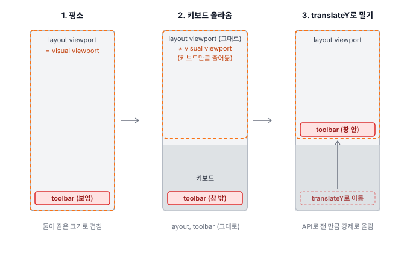

이때 사용되는 기능은 각 3가지 입니다.  
표 만으로는 이해가 어려우니, 표 아래의 이미지까지 천천히 대조하며 읽어보시길 바랍니다.

<table style="border-collapse:collapse;width:100%;margin:16px 0;font-size:.95em;border:1px solid rgba(255,255,255,.3)">
    <thead>
        <tr style="border-bottom:2px solid rgba(255,255,255,.45)">
            <th style="text-align:left;padding:8px 12px;border-right:1px solid rgba(255,255,255,.3)">이름</th>
            <th style="text-align:left;padding:8px 12px;border-right:1px solid rgba(255,255,255,.3)">속성</th>
            <th style="text-align:left;padding:8px 12px">하는 일</th>
        </tr>
    </thead>
    <tbody>
        <tr style="border-bottom:1px solid rgba(255,255,255,.3)">
            <td style="padding:8px 12px;white-space:nowrap;border-right:1px solid rgba(255,255,255,.3)">Safari</td>
            <td style="padding:8px 12px;white-space:nowrap;border-right:1px solid rgba(255,255,255,.3)">브라우저</td>
            <td style="padding:8px 12px">-> visual viewport의 높이나 현재 위치가 "바뀌었어"라고 알려줌  바뀌는 조건 : 1. 키보드가 올라올 때 (height가 바뀜) 2. 키보드가 뜬 채 스크롤할 때 (offsetTop이 바뀜)  2번은 키보드와 무관하게 일어나지만, 툴바를 밀어야 하는 건 키보드가 뜬 상태일 때입니다.</td>
        </tr>
        <tr style="border-bottom:1px solid rgba(255,255,255,.3)">
            <td style="padding:8px 12px;white-space:nowrap;border-right:1px solid rgba(255,255,255,.3)">Visual Viewport API</td>
            <td style="padding:8px 12px;white-space:nowrap;border-right:1px solid rgba(255,255,255,.3)">브라우저에 내장된 조회 기능</td>
            <td style="padding:8px 12px">-> 바뀐 visual viewport의 값을 알려줌  1. <code>height</code> — 창 높이 (윗변에서 아랫변까지) 2. <code>offsetTop</code> — 창 윗변이 문서 맨 위에서 얼마나 내려와 있나 (안 밀렸으면 0)</td>
        </tr>
        <tr>
            <td style="padding:8px 12px;white-space:nowrap;border-right:1px solid rgba(255,255,255,.3)">update()</td>
            <td style="padding:8px 12px;white-space:nowrap;border-right:1px solid rgba(255,255,255,.3)">내부 작성 코드</td>
            <td style="padding:8px 12px">-> 아래 순서대로 처리  1. 높이나 현재 위치가 바뀌었다는 Safari 이벤트 수령 2. API가 알려준 <code>height</code>·<code>offsetTop</code> 확인 3. 둘을 더해 창 아랫변의 문서 좌표(<code>offsetTop + height</code>)를 구하고, 툴바를 거기까지 <code>translateY</code>로 밀기</td>
        </tr>
    </tbody>
</table>
 
어떠신가요? 바뀌는 조건이 머릿속에 잘 안 그려질겁니다.  
그래서 아래의 이미지를 준비했습니다. 위 표의 "바뀌는 조건" 둘을 하나씩 그린 것입니다.

---

**케이스 1 — 키보드가 올라올 때 (높이가 바뀜)**

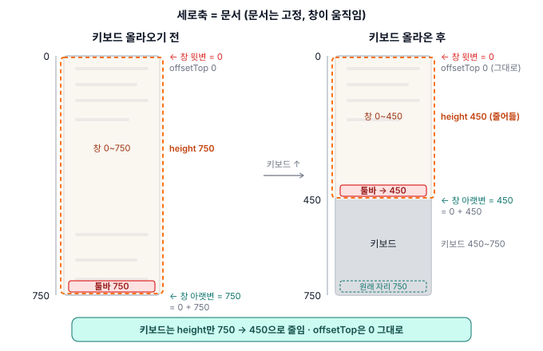

왼쪽은 키보드가 올라오기 전입니다.   
창이 문서 0 ~ 750을 다 차지하고, height 750, offsetTop 0  
-> 툴바는 창 아랫변 750에 있습니다. 

오른쪽은 키보드가 올라온 후입니다.     
키보드가 문서 450 ~ 750 자리를 먹으니   
창이 0 ~ 450으로 줄어듭니다. 
height 450, offsetTop은 그대로 0  
-> 툴바가 원래 자리 750에 있으면 키보드 뒤라, 창 아랫변 450으로 밀어야 합니다. / translateY(0 + 450)

---

**케이스 2 — 키보드가 뜬 채 스크롤할 때 (현재 위치가 바뀜)**

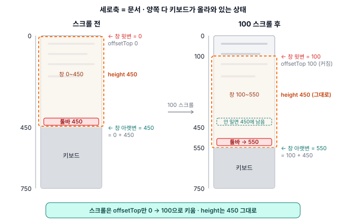

왼쪽은 케이스 1의 오른쪽과 같은 상태입니다.   
창 0 ~ 450, height 450, offsetTop 0, 툴바 450  

오른쪽은 여기서 100 아래로 스크롤 한 뒤입니다.   
문서가 위로 밀리니 보이는 부분(창)은 100 내려가 100 ~ 550이 됩니다.   
height는 450 그대로, offsetTop만 100으로 커집니다.  

이때, 툴바를 안 밀면 450에 남아 창 안에서 100 위로 떠 보이니, 아랫변 550으로 다시 밀어야 합니다. / translateY(100 + 450)

이렇게 두 케이스를 적용하려고 했습니다만...  
살펴보니, 세 가지 문제가 있었습니다.

---

##### 2-2-1. 스크롤 문제 - 키보드가 뜬 채로 스크롤하면 툴바 위치가 망가진다


케이스 2가 한번만 작동한다면 괜찮습니다. 다만 스크롤할 때마다, 매번 위치조정 문제가 발생한다는 점입니다.  
키보드가 뜬 채 스크롤하면 창의 크기(height)는 그대로고 위치(offsetTop)만 계속 바뀝니다.  
그때마다 Safari가 "바뀌었어"를 보내고, update()가 툴바를 다시 밉니다.

그런데 iOS는 이 신호를 스크롤하는 순간마다 보내지 않습니다.  
신호와 신호 사이에는 툴바가 자리를 벗어난 채로 있고, 신호가 오면 당겨지고, 또 벗어나고, 또 당겨지고…  
이게 반복되니 스크롤 중엔 덜덜거리게 됩니다.

---

##### 2-2-2. iOS 26 버그 - 키보드를 닫아도 API가 옛 offsetTop을 보고합니다.

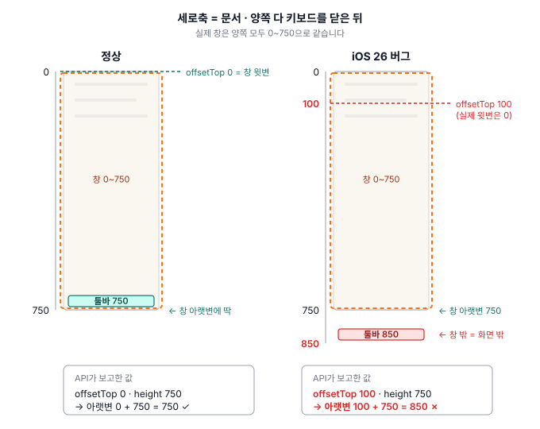

이번에는 키보드를 닫은 뒤입니다. 실제 창은 양쪽 모두 0~750으로 돌아왔습니다.  
왼쪽은 API도 그렇게 보고합니다. offsetTop 0, height 750이니 아랫변은 750. 툴바가 제자리입니다.

오른쪽은 iOS 26 버그입니다. height는 750으로 맞는데 offsetTop이 100에 그대로 남아 있습니다.  
update()는 그 값을 믿고 아랫변을 850으로 계산하니, 툴바를 창 밖으로 밀어버립니다. 

---

##### 2-2-3. 주소창 문제 - 키보드 위 자리가 우리 것이 아니다.

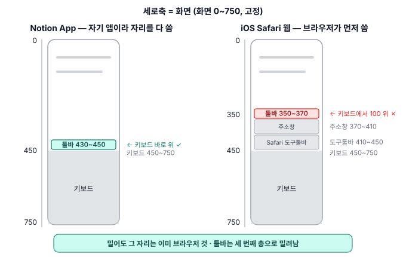

Notion App(왼쪽)은 키보드(450 ~ 750) 바로 위 430 ~ 450에 툴바를 붙일 수 있습니다.  

반면, iOS Safari 웹(오른쪽)은 그 자리를 브라우저가 먼저 씁니다.
키보드 바로 위에 Safari 도구툴바(410 ~ 450),  
그 위에 주소창(370 ~ 410)이 올라오고, 우리 툴바는 그 위 350 ~ 370으로 밀려납니다. 

즉, 키보드에서 100 떨어진 세 번째 층입니다.  
Notion App처럼 키보드 위에 붙이려고 해도, 웹의 경우는 제약이 존재합니다.

---

#### 3. 해결방안 - 키보드 위 툴바고정(x), 목록상자 대처(o)
---

키보드 위에 고정으로 쓰지 못하니, 툴바가 키보드에 영향을 받지 않는 자리로 가야 했습니다.  
그리고 그 자리에 뜨는 것을 **상자 하나**로 처리 했습니다.

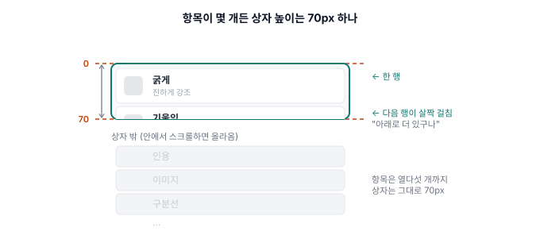

상자는 이렇게 생겼습니다.  
항목이 세로로 나열되고, 높이는 모바일에서 70px로 고정이며, 이외 항목은 터치 스크롤을 통해 사용 가능합니다.  

이 상자가 열리는 방식은 세 가지입니다.

---

##### 3-1. 슬래시를 치면

본문에서 `/`를 치면 커서 옆에 상자가 뜹니다.  
이 기능의 특징은 키보드가 아니라 커서를 기준으로 자리를 잡는다는 것입니다.  
툴바 고정에서 막혔던 게 키보드를 기준으로 삼는 것이었으니, 기준을 바꾼 셈입니다.

---

##### 3-2. 글자를 드래그하면

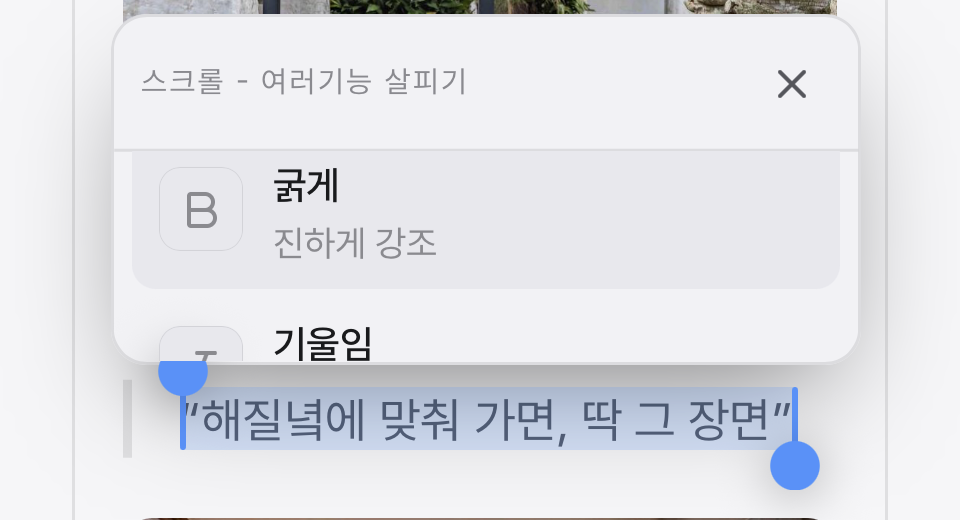

글자를 선택하면, 그 위에 `/`때 처럼 같은 상자가 뜹니다.  
슬래시와 같은 상자이고, 내용 중간 중간에 편집이 필요했기에 넣은 기능입니다.

---

##### 3-3. 툴바의 더보기(⋯)를 누르면

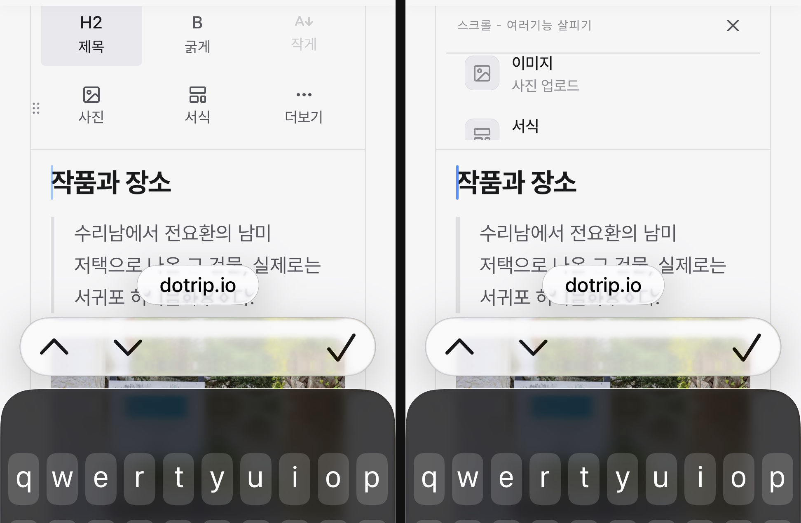

상단의 툴바에서 더보기(⋯)를 누르면 상자가 열립니다.

여기서 상자는 팝업으로 뜨지 않습니다. 툴바 자리에 **바꿔 끼워집니다.**  
여섯 칸 그리드가 사라지고 그 자리에 상자가 들어갑니다.

팝업으로 띄우면 본문을 가리거나 밀게 됩니다.  
그러면 상자를 닫았을 때 쓰던 자리를 다시 찾아야 하는데, 글을 쓰는 중에는 그게 제일 성가십니다.

그래서 새로 띄울 자리를 찾는 대신, 툴바가 이미 쓰고 있던 자리를 그대로 썼습니다.  
그리드와 상자의 높이가 같아서 바뀌어도 툴바가 차지하는 자리는 그대로고, 본문은 밀리지 않습니다.

---

#### 4. 적용 후 결론

---

##### 4-1. 해결 - 툴바를 고정하지 않고도 모바일에서 편집이 된다

위의 목록상자 해결방안을 통해,  
키보드 위 툴바고정 없이도 사용 할 수 있게 되었습니다.

다만 한 가지 밝혀둘 게 있습니다.  
목록 상자는 지금도 `position: fixed`를 사용하고 있습니다.  
이 글이 fixed를 못 쓰는 것처럼 설명하여, 모순처럼 보일 수 있습니다만…

문제는 fixed 자체가 아니라 **키보드를 기준으로** fixed를 두는 것이었습니다.  
목록 상자는 키보드가 아니라 커서를 따라가며 움직입니다.  
'키보드 위 툴바 고정'이 필요 없게 되어, translateY 계산을 고려할 필요가 없게 됩니다.

{/* 
커서는 브라우저가 그린 문서 안에 있습니다.   
브라우저는 자기가 그린 것의 위치를 다 알고 있어서, 커서가 어디 있냐고 물어보면 바로 답이 나옵니다.  

반면, 키보드는 브라우저가 그린 것이 아닙니다.  
iOS가 화면 위에 덮은 것이라 브라우저가 위치를 모르고, "보이는 영역이 줄었다"는 것만 나중에 알려주게 됩니다.  
-> 2-2 에서의 표 safari 내용에서 일어나는 일이 여기서 일어난다고 보시면 됩니다.

같은 fixed라도, 위치를 아는 것을 기준으로 삼느냐 모르는 것을 기준으로 삼느냐에서 갈렸습니다. */}

---

##### 4-2. 남은 문제 두 가지 - 목록 상자랑 겹치는 iOS 메뉴, 스크롤 중 메뉴 상자 떨림 현상

다만 목록 상자로 바꿨다고 모든 문제가 사라진 건 아니었습니다. 둘이 남았습니다.

**첫째, iOS 선택 메뉴가 상자를 가립니다.**  
글자를 드래그하면 상자가 그 위에 뜨는데, iOS도 같은 자리에 오려두기·복사하기 메뉴를 띄웁니다.  
이걸 막을 방법은 없습니다. iOS 선택 메뉴는 웹에서 끌 수 없고, 선택을 풀면 서식을 적용할 대상이 사라지니까요.

**둘째, 목록 상자가 스크롤 중에 떨렸습니다.**  
상자가 뜬 채로 스크롤을 내리면, 상자가 미세하게 떨렸습니다.

당시엔 이 문제를 위치 갱신에만 있다고 판단하여 고쳤습니다만,  
여전히 떨림문제는 해결이 되지 않고 있었습니다.

---

##### 4-3. 메뉴 상자 떨림 해결 - 매 프레임 렌더링 문제

떨림은 나중에 풀렸습니다.

계기는 다른 문제였습니다.  
글자를 드래그해서 연 상자에서 '굵게'를 누르면 글자가 넓어지면서 문단 줄이 바뀌고,  
선택 영역이 움직여서, 거기에 붙어 있던 상자도 같이 자리를 옮기는 문제가 발생 했었습니다.  

이건 상자안의 '기능(굵게, 작게, 취소선 등등...)'을 누르는 순간 상자를 닫아버리는 걸로 정리했습니다.  
움직이는 게 보이기 전에 없애는 것이였죠.

그리고 그걸 고치려고 여러 번 시도하다가, 상자 높이가 스크롤 중에 계속 바뀌는 걸 확인했습니다.  
슬래시 상자가 떨리던 원인이 여기 있었습니다. 

위치 갱신이 아닌 목록 상자높이가 유동적으로 변한 것이 원인이였던 것이죠.

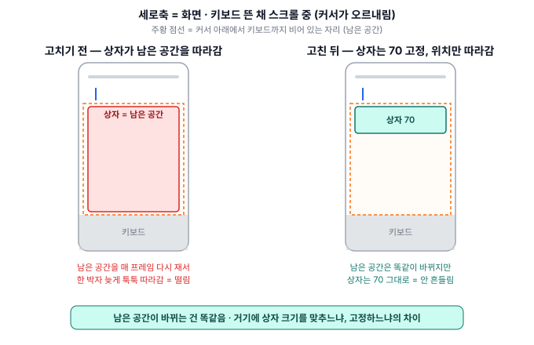

왼쪽이 고치기 전입니다.  
주황 점선이 커서 아래로 남은 공간이고, 상자는 그 공간을 꽉 채우도록 만들어져 있었습니다.  
그래서 스크롤로 커서가 움직여 남은 공간이 바뀌면, 상자도 매 프레임 그 크기에 맞춰 늘었다 줄었다 했습니다.  
그게 눈에는 떨림으로 보였던 것입니다.

오른쪽이 고친 뒤입니다.  
남은 공간은 똑같이 바뀌지만, 상자는 70px 고정이라 그 안에서 크기를 유지합니다.  
스크롤로 커서가 움직여도 상자는 위치만 따라갑니다. 이후 목록상자의 떨림이 사라졌습니다.

---

##### 4-4. iOS 메뉴 겹침 해결 - Notion 웹앱처럼 전체 화면으로 개선 예정

앞에서 남은 iOS 메뉴와 목록 메뉴가 겹치는 문제는 아직 해결하지 못했습니다. 
이 문제를 해결하기 위하여, Notion을 모바일 브라우저로 열어봤고, 답은 거기 있었습니다.

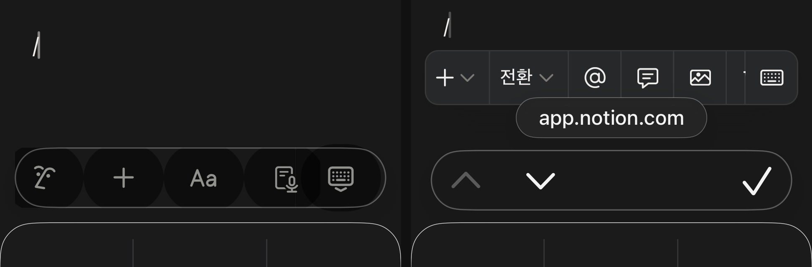

Notion 웹은 목록을 누르면 키보드를 내리고, 화면 전체를 목록으로 채웁니다.

글자를 선택한 상태에서 벗어나니 iOS 메뉴가 뜰 이유가 없고, 목록이 키보드 옆에서 자리 싸움을 할 일도 없습니다.  
Notion 웹은 목록을 위에 두느냐 아래에 두느냐를 고민하던 판 자체를 벗어난 것이죠.

Dotrip도 이 방식으로 바꿀 생각입니다. 앞에서 남은 iOS 메뉴 겹침이 이걸로 풀리기 때문입니다.

그리고 저는 이 화면에서 하나 더 보았습니다.  
Notion도 웹에서는 키보드 위에 툴바를 두지 않았습니다. Notion App에서는 툴바가 키보드 위에 고정인데, Notion 웹에서는 툴바가 커서 아래에 떠 있습니다.  
App에서 되는 것과 웹에서 되는 것이 다르다는 걸, Notion은 이미 알고 있었던 것입니다.

돌아보면 저는 Notion App의 답을 가져오면서, 그 답이 왜 Notion App에서 되는지를 생각해 보지 않았습니다.  
Notion App의 키보드 위 툴바는 OS가 그 자리를 보장해 준다는 조건 위에서만 성립하는 답이었고, 웹에는 그 조건이 없었습니다.  
답만 보고 그 답이 성립하는 조건을 보지 않은 것이 이번 시행착오의 주요 원인이였습니다.

다음부터는 다른 서비스의 방식을 따라 하기 전에, 그 방식이 거기서 되는 이유를 먼저 찾을 것입니다.  
이유를 알면 제 환경에서도 되는지가 보이고, 모르면 옮겨도 안 될 수 있다는 걸 이번에 중요하게 배웠습니다.